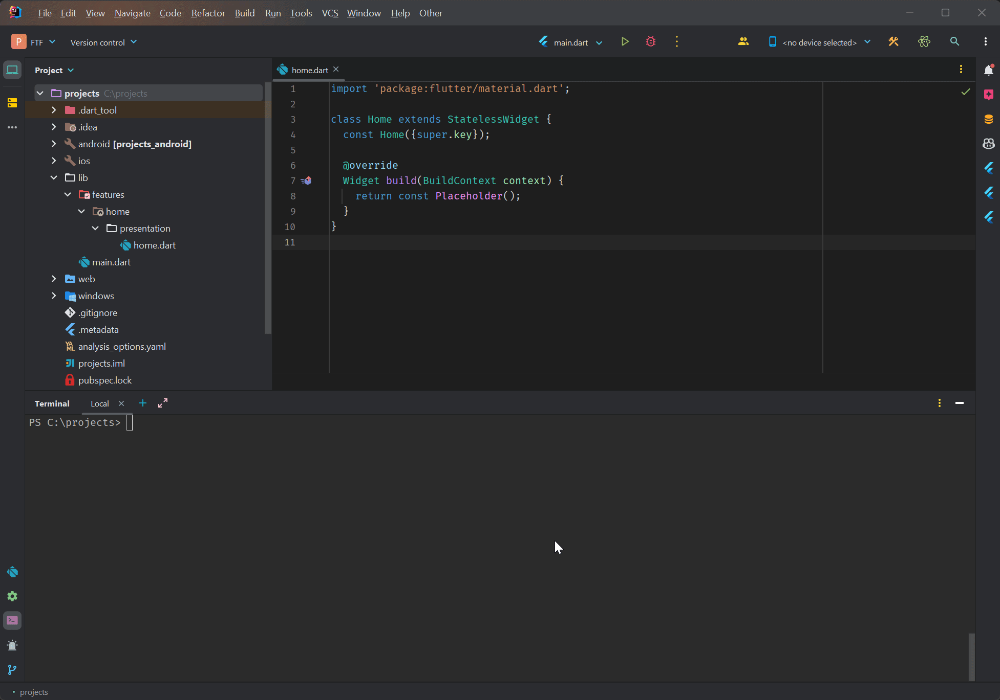
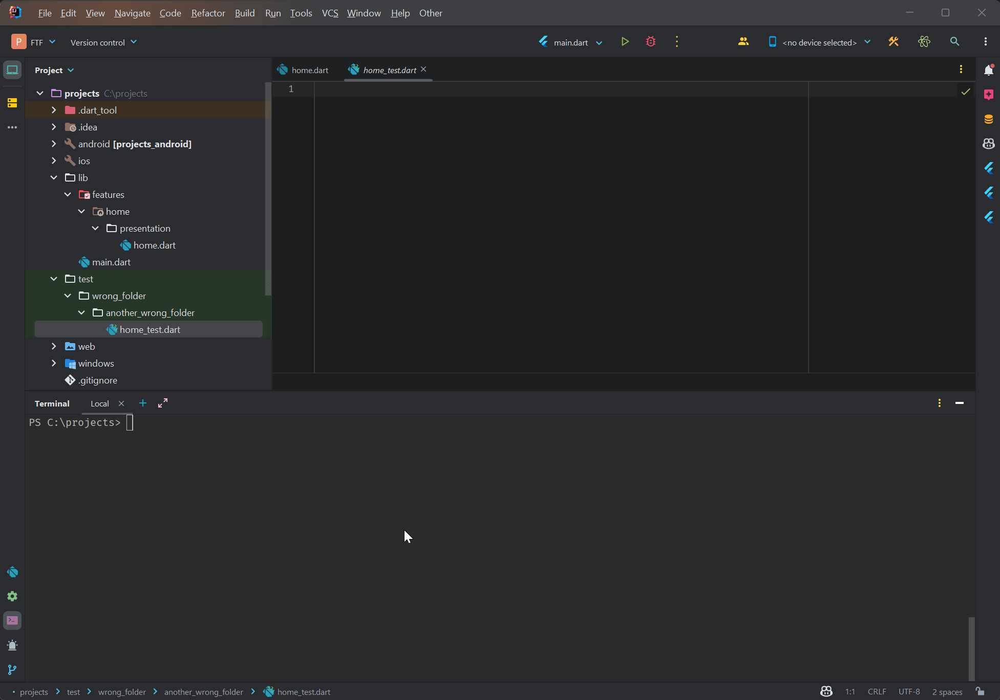

# Flutter Test File (FTF)


FTF helps you to create and manage test files in Flutter projects, making sure they're in the right place and preserving version control history. It's a simple tool for easier project organization.

## Features

- **Effortless Test File Creation**: FTF makes it easy to create test files by placing them in the appropriate directory within the test folder.
- **Intelligent Handling**: If a test file with the same name already exists, FTF will prompt you to confirm the move to the correct location, ensuring organization and preventing overwriting.
- **Recursive empty directory removal**: FTF will remove empty directories recursively, ensuring that your project's test folder is clean and organized.
- **Version Control Support**: FTF seamlessly integrates with popular version control systems like SVN, GIT, or simply move it with Powershell, ensuring that file moves preserve your project's history.

# Installation

To use FTF, follow these installation steps:

1. **Add to PATH**: Add the folder containing FTF to your system's environment PATH variables. This enables you to run FTF from any location within your terminal.

# Usage

Using FTF is straightforward. Follow these steps:

1. **Navigate to Project Root**: Open your terminal and navigate to the root directory of your Flutter project or package.

2. **Run FTF**: Enter the following command:
    ```
    ftf
    ```
3. **Follow Instructions**: FTF will prompt you to enter the file name. Once you provide the file name and press enter, FTF will guide you through the process, ensuring the test file is created or moved to the appropriate location.

With FTF, managing your Dart test files becomes a breeze. Save time and maintain a well-organized project structure with this convenient tool.

# Contribution
Contributions to FTF are welcome! If you find any issues or have ideas to improve the tool, please feel free to open an issue or submit a pull request on the GitHub repository. Your contributions help make FTF even better for the community.



